# Sybil Defender

## Layer Zero Submission Methodology

Commonwealth submission link (for cross reference) - https://commonwealth.im/layerzero/discussion/19392-sybil-report-by-frwd1-aka-frwd-labs-repost-of-original-github-issue-667-submitted-may-18th-approx-0205-utc

The methodology is based primarily on research found in this paper - https://arxiv.org/pdf/2209.04603 and prior work done in the Arbitrum and Hop sybil detection programs - https://github.com/ArbitrumFoundation/sybil-detection

The Sybil Defender is deployed on the Forta network and has been continuously monitoring and labeling Sybil activity on 7 blockchains since November 2023 (Ethereum, Arbitrum, Polygon, Avalanche, Optimism, BSC, and Fantom).

Forta runs a decentralized network of EVM nodes that provide a stream of continuous transaction data to the Sybil Defender for each monitored chain.

As transactions are confirmed, they are screened for basic data quality, then ingested and stored in a temporary database for further analysis. Transactions are analyzed in batches of 50,000 for each blockchain, and separated into (1) wallet to wallet transfers (of native asset such as Ether or Avax), and (2) wallet to contract interactions (including the specific methods called on the contract).

Transactions are analyzed in batches of 50k in order to narrow the timeline for when a cluster forms into one that is most likely to by Sybil behavior, and less likely to be honest behavior. Sybil attackers are often using automated bots / tools to maximize volume and efficiency, so Sybil behavior tends to occur in clear, systemetized patterns that repeat in quick succession (ie, within minutes or seconds). While it varies by chain, 50,000 transactions happen within the space of about 15 - 90 minutes. After initial clustering algorithms are applied, any clusters smaller than 5 wallets are eliminated. The remaining clusters are considered to have higher likelihood to be Sybils and warranting further analysis given the rapid movement of funds between 5 or more wallets in a relatively short time span. Note that the 5 wallet threshold is just the threshold for the batch timeline, and doesn't necessarily reflect the final size of a cluster which are often much larger.

Wallet to wallet transfers in each batch are added to a Network X graph for further analysis with nodes represented by wallet addresses and edges represented by transfers between wallets. A Weakly Connected Component (WCC) algorithm is applied to the graph in order to begin to categorize connected groups of wallets into distinct components. If any very large clusters are detected, they are further refined by a Louvain algorithm.

Once wallets are grouped into unique components (ie, initial clusters), their addresses are queried against the batch's wallet to contract interaction database to find out what contracts they interacted with and what methods were called during the batch time frame. The contract interaction patterns (method and contract) for the wallets within a unique cluster are compared against each other using a jaccard similarity analysis (similar to the technique in this paper - https://arxiv.org/pdf/2209.04603 ). If the similarity threshold is greater than 50%, then the component is considered a Sybil cluster and labeled as such for ongoing tracking

Note - Sybil attackers are aware that automated detection systems are often looking for similar contract interaction patterns, so they will try to obscure their activity by using "pass through" wallets that don't engage in contract interactions, but funnel funds for other wallets. For this reason, we chose a similarity threshold of 50%. We still consider it unlikely that legitimate users will be conducting this kind of activity to more than 5 wallets in the short time frame and deemed the risk of false positive low with a threshold of 50%.

Once Sybil clusters are labeled and identified, they are tracked in a database in order to monitor for additional activity. If a new batch identifies additional clusters that overlap with previously identified ones, they are appended on as components of existing clusters and their cluster ID is updated.

Two major patterns / typologies of Sybil behavior are evident after manual quality review of the clusters, 1) Radial patterns, and 2) sequential patterns.

1. Radial Pattern - where a single wallet funds many wallets that engage in Sybil actions. The example below from our Layer Zero Submission Report illustrates this -

January 21, 2024 - on the Fantom blockchain, Funder Wallet (0x87efcda3e6f46916bc1b38428dc6f21fa4795350) sends 10 Fantom to 15 unique wallets. The purpose of the native Fantom is to pay gas fees.

<table>
  <tr>
    <td>
      
    </td>
  </tr>
</table>

All funded wallets subsequently engage in the same sequence of contract interactions, calling the same methods on the same contracts in a very short period of time.

For example, on 2024-01-21 20:28:16, Funded Wallet #1 (0xdDdDF9454429d0f8838A10C5C28Dd8C0B92488a7) receives ~1,003 USDC from a Stargate Finance LP contract.

<table>
  <tr>
    <td>
      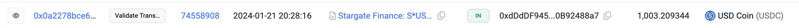
    </td>
  </tr>
</table>

2 minutes later at 20:37:09, Funded Wallet #1 receives 10 FTM from the Funder Wallet. 2 minutes later at 20:39:24, Funded Wallet #1 approves USDC for trade and calls the swap function on the Stargate Finance: Router contract, in order to swap the $1,003 USDC and pays ~.93 FTM in gas fees.

<table>
  <tr>
    <td>
      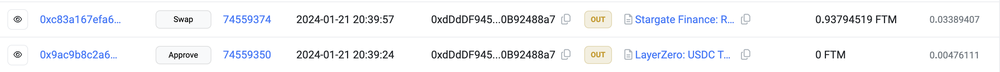
    </td>
  </tr>
</table>

Funded Wallet #2 (0x0B17e98fA7F6c0B0c5201A5Aa06Ee80381D1403E) follows the exact same pattern:

<table>
  <tr>
    <td>
      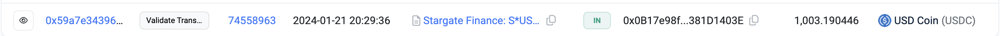
    </td>
  </tr>
</table>

<table>
  <tr>
    <td>
      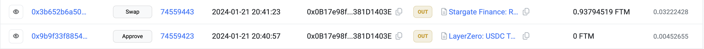
    </td>
  </tr>
</table>

Funded Wallet #3 (0x4e036637E2E3b498943C3728C013d2e576da9db0) follows the exact same pattern:

<table>
  <tr>
    <td>
      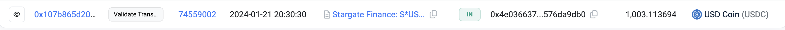
    </td>
  </tr>
</table>

<table>
  <tr>
    <td>
      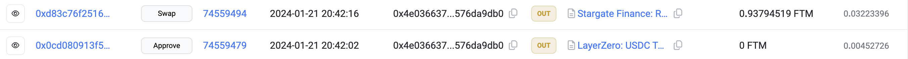
    </td>
  </tr>
</table>

The process is repeated over the course of several months with more and more wallets continuously being created and added to the Sybil network

2. Sequential Pattern - instead of funding many wallets from a single wallet, wallets are funded sequentially in a pattern that involves first funding a wallet with native asset for gas, second engaging in sybil actions, and finally sending gas funds to the next wallet in a sequence to repeat the pattern. The example from our Layer Zero Sybil Report below shows this on the Avalanche chain:

Wallet A (0x606600eBDD1A91713Cc263b1145584adF6bDc0AC) receives ~.26 Avax at 2023-11-26 11:58:25. 5 minutes later, Wallet A approves tokens for trade and calls the swap function on the Stargate Finance: Router contract. 1 minute later, Wallet A transfers ~.22 Avax to Wallet B

<table>
  <tr>
    <td>
      
    </td>
  </tr>
</table>

6 minutes later, Wallet B repeats the pattern

<table>
  <tr>
    <td>
      
    </td>
  </tr>
</table>

Wallet B funds Wallet C and the pattern continues through several dozen wallets

<table>
  <tr>
    <td>
      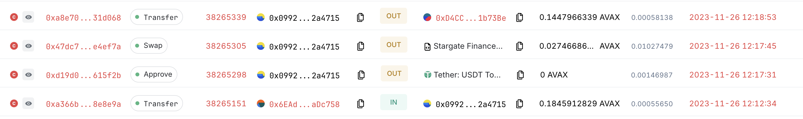
    </td>
  </tr>
</table>

## Summary and Additional Information

The Sybil Defender identifies and labels Sybil Attack clusters operating on EVM chains. This includes Ethereum, Arbitrum, Optimism, Polygon, Binance Smart Chain, Avalanche, and Fantom. It monitors transactions to detect patterns that may indicate Sybil behavior, such as Airdrop Farming, Governance Attacks, and Wash Trading/Market Manipulation.

## Features

- **Real Time Monitoring:** Monitors on-chain transactions in real time.
- **Dynamic Clustering:** Dynamically updates existing clusters based on incoming activity.
- **Heuristic Analysis:** Applies heuristics to initially assess transactions for Sybil attack patterns.
- **Community Detection:** Employs sophisticated algorithms to identify communities.
- **Sybil Detection:** Filters communities for known Sybil Attack patterns to generate accurate alerts.
- **State Persistence:** Keeps track of historical data for dynamic clustering and real-time analysis.

## Performance

During a performance evaluation, Sybil Defender analyzed a sample of approximately 8 hours of activity on the Arbitrum network prior to the airdrop snapshot in March 2023. The analysis identified 211 Sybil Clusters consisting of 7731 nodes in total.

In addition, this evaluation confirmed the identification of all 4 clusters highlighted by [Arbitrum's](https://github.com/ArbitrumFoundation/sybil-detection) Sybil detection mechanisms.

The full sample graph file can be found [here](src/tests/ArbitrumSampling.graphml).

## Sample 1

<table>
  <tr>
    <td>
      <b>Sybil Defender:</b> Identified Sybil cluster with 95 eligible nodes
       
      
    </td>
    <td>
      <b>Arbitrum Detection:</b> Identified Sybil cluster with 56 eligible nodes
       
      
    </td>
  </tr>
  <tr>
    <td colspan="2" style="text-align:center;">
      Common address: 0xc7bb9b943fd2a04f651cc513c17eb5671b90912d
    </td>
  </tr>
</table>

## Sample 2

<table>
  <tr>
    <td>
      <b>Sybil Defender:</b> Identified Sybil cluster with 99 eligible nodes
       
      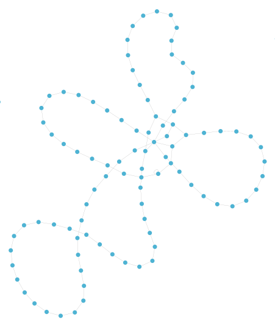
    </td>
    <td>
      <b>Arbitrum Detection:</b> Identified Sybil cluster with 110 eligible nodes
       
      
    </td>
  </tr>
  <tr>
    <td colspan="2" style="text-align:center;">
      Common address: 0x1ddbf60792aac896aed180eaa6810fccd7839ada
    </td>
  </tr>
</table>

## Sample 3

<table>
  <tr>
    <td>
      <b>Sybil Defender:</b> Identified Sybil cluster with 507 eligible nodes
       
      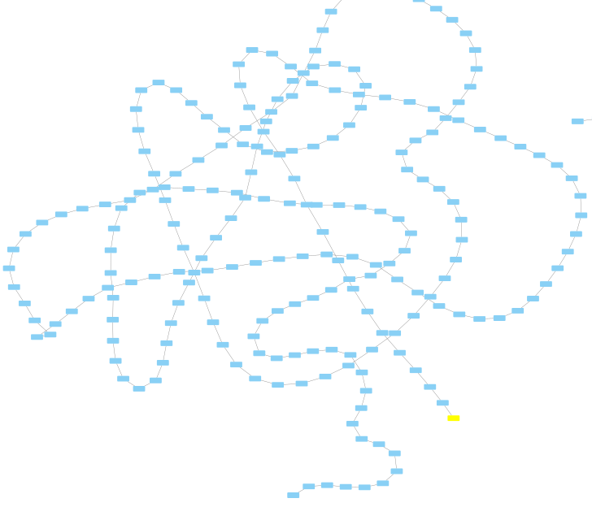
    </td>
    <td>
      <b>Arbitrum Detection:</b> Identified Sybil cluster with 121 eligible nodes
       
      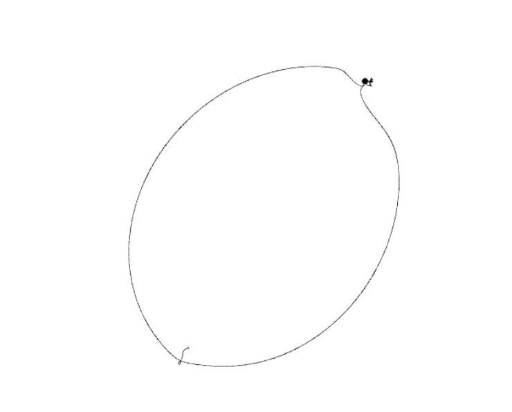
    </td>
  </tr>
  <tr>
    <td colspan="2" style="text-align:center;">
      Common address: 0x3fb4c01b5ceecf307010f84c9a858aeaeab0b9fa
    </td>
  </tr>
</table>

## Sample 4

<table>
  <tr>
    <td>
      <b>Sybil Defender:</b> Identified Sybil cluster with 51 eligible nodes
       
      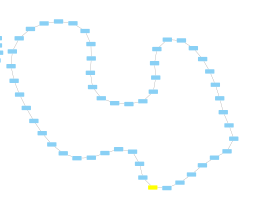
    </td>
    <td>
      <b>Arbitrum Detection:</b> Identified Sybil cluster with 65 eligible nodes
       
      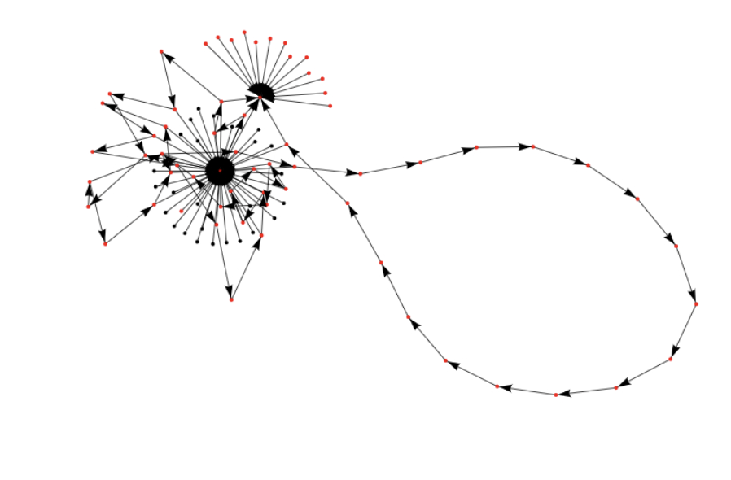
    </td>
  </tr>
  <tr>
    <td colspan="2" style="text-align:center;">
      Common address: 0x15bc18bb8c378c94c04795d72621957497130400
    </td>
  </tr>
</table>
