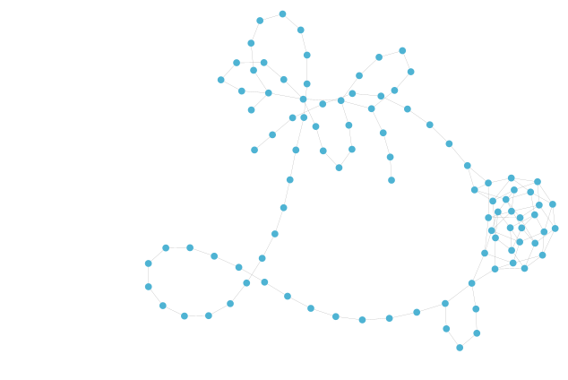
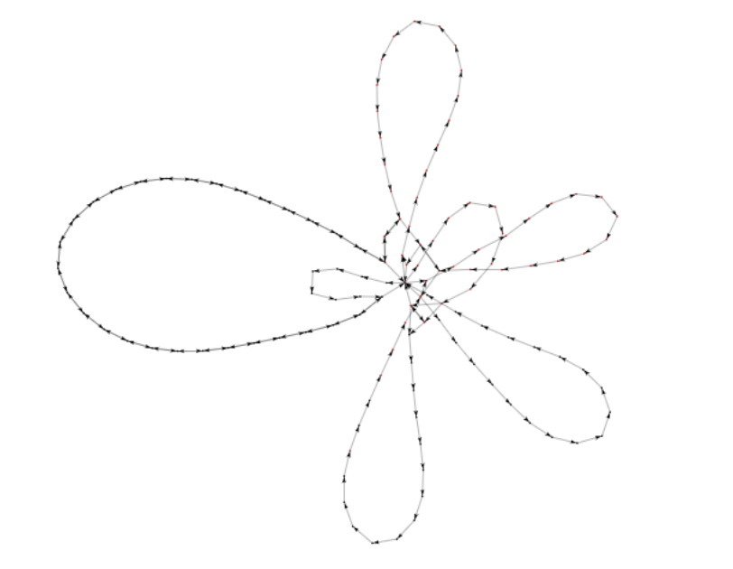
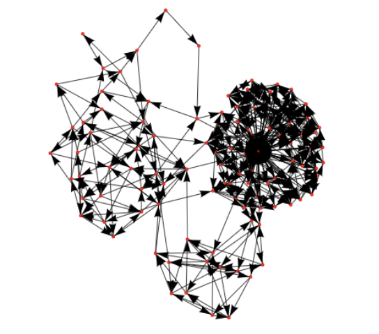

# Sybil Defender

## Overview

Sybil Defender is a Forta bot developed to identify Sybil attacks on the application layer of EVM-compatible blockchains. This includes Ethereum, Arbitrum, Optimism, Polygon, Binance Smart Chain, Avalanche, and Fantom. It monitors transactions to detect patterns that may indicate Sybil behavior, such as Airdrop Farming, Governance Attacks, and Wash Trading/Market Manipulation.

## Features

- **Real Time Monitoring:** Monitors on-chain transactions in real time.
- **Dynamic Clustering:** Dynamically updates existing clusters based on incoming activity.
- **Heuristic Analysis:** Applies heuristics to initially assess transactions for Sybil attack patterns.
- **Community Detection:** Employs sophisticated algorithms to identify communities.
- **Sybil Detection:** Filters communities for known Sybil Attack patterns to generate accurate alerts.
- **State Persistence:** Keeps track of historical data for dynamic clustering and real-time analysis.

## Performance Insights

Sybil Defender has demonstrated remarkable effectiveness in identifying and analyzing Sybil attack patterns. In a targeted performance evaluation, the application analyzed approximately 8 hours of Arbitrum network activity. This intensive analysis led to the discovery of 211 Sybil Clusters, encompassing a total of 7731 nodes. This finding is significant as it showcases the depth and breadth of Sybil Defender's monitoring capabilities.

Furthermore, the same sampling session successfully identified all 4 clusters that were previously highlighted by Arbitrum's own Sybil detection strategy. This not only validates the accuracy of Sybil Defender's detection algorithms but also emphasizes its ability to match and exceed existing Sybil detection standards.

## Comparison Example 1

<table>
  <tr>
    <td>
      <b>Sybil Defender:</b> Identified Sybil cluster with 95 eligible nodes
       
      
    </td>
    <td>
      <b>Arbitrum Detection:</b> Identified Sybil cluster with 56 eligible nodes
       
      
    </td>
  </tr>
  <tr>
    <td colspan="2" style="text-align:center;">
      Sample address: 0xc7bb9b943fd2a04f651cc513c17eb5671b90912d
    </td>
  </tr>
</table>

## Comparison Example 2

<table>
  <tr>
    <td>
      <b>Sybil Defender:</b> Identified Sybil cluster with 99 eligible nodes
       
      
    </td>
    <td>
      <b>Arbitrum Detection:</b> Identified Sybil cluster with 110 eligible nodes
       
      
    </td>
  </tr>
  <tr>
    <td colspan="2" style="text-align:center;">
      Sample address: 0x1ddbf60792aac896aed180eaa6810fccd7839ada
    </td>
  </tr>
</table>

## Comparison Example 3

<table>
  <tr>
    <td>
      <b>Feature E:</b> Description for feature E...
       
      
    </td>
    <td>
      <b>Feature F:</b> Description for feature F...
       
      
    </td>
  </tr>
</table>

## Your Existing Comparison

<table>
  <tr>
    <td>
      <b>Arbitrum Detection:</b> Detected a cluster with 56 addresses for node <code>0xc7bb9b943fd2a04f651cc513c17eb5671b90912d</code>.
       
      
    </td>
    <td>
      <b>Sybil Defender Detection:</b> Detected a more complex cluster with 96 addresses for the same node.
       
      
    </td>
  </tr>
</table>

Sybil Defender demonstrated a higher capability in identifying and visualizing complex clusters compared to Arbitrum's detection method.
